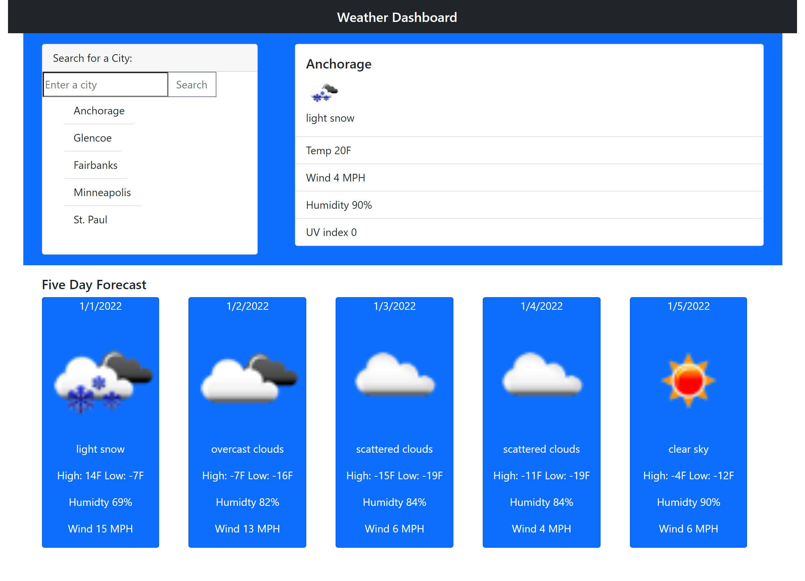

# unitSixWeatherDashboard

## GIF of page

[Here is a link to the deployed page](https://amber-robeck.github.io/unitSixWeatherDashboard/ "Day scheduler")

---
## Weather Dashboard

Incorporating multiple API calls to the [OpenWeatherMapAPI](https://openweathermap.org), using the [forecast](https://openweathermap.org/forecast5) and [one call](https://openweathermap.org/api/one-call-api) endpoints; this website allows users to search for a city and upon input receive the current weather along with a five day forecast. This website is utilizing [Bootstrap](https://getbootstrap.com/) to help create a clean and polished user interface. 

When the user enters a city:
* a card containing the current weather pops up containing the city name, weather icon, brief description of conditions, current temp, wind speed, humidity and UV index that changes color to indicate whether current UV conditions are favorable (green), moderate(yellow), or severe(red)
* five cards dynamically appear on the page to bring user a five day forecast incuding daily high and low temperatures
* users input is saved to local storage, limited to five different cities, newest city searched is pushed to the top of the list
* buttons are created dynamically for each city searched to allow user to click on previously seached cities and bring the forecast of that city back

## Screenshot of page

#### This page was created for school, I was presented with a user story, a list of acceptance criteria and a mock-up of functionality